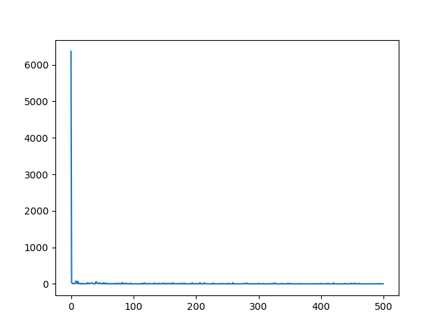
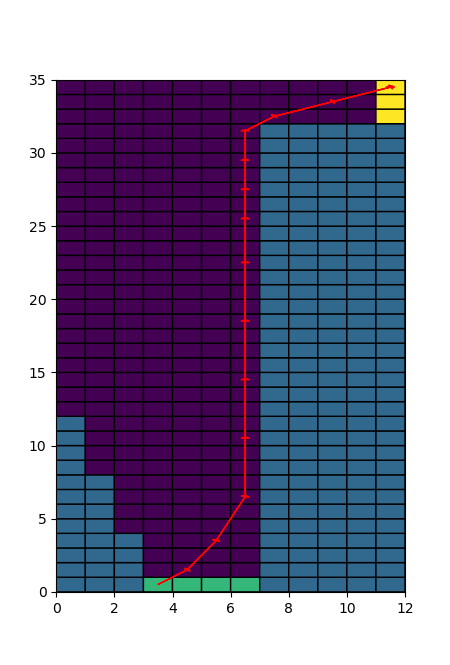

<!--
 * @Author: your name
 * @Date: 2021-05-03 23:22:05
 * @LastEditTime: 2021-05-04 12:39:49
 * @LastEditors: your name
 * @Description: In User Settings Edit
 * @FilePath: /Motion-plan/第七章：基于马尔可夫决策过程的运动规划/README.md
-->
# 第七章作业

本次作业主要是完成RTDP(Real Time Dynamic Programming)算法，RTDP算法主要包括以下几个步骤：

* 初始化所有节点的初始G值，此处选择栅格地图中的理论最优距离：
  $$
  dist=abs(dx)+abs(dy)-(\sqrt{2}-2)*min(dx,dy)
  $$

* 使用greedy policy选择一条可以从起点到终点的最小cost的路径，此处为了数值稳定性和避免陷入局部最优解，选择在$\%20$的概率下在进行输入选择时不选择最小cost的输入，而是随机选择一个输入

* 遍历选择的路径，更新路径上每个节点对应的cost值
* 重复上述过程，直到前后两次迭代的贝尔曼误差小于一定阈值

仿真结果如下：

